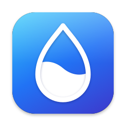

<div align="center">



# Dewlet

**Send photos, files and text between Android and your Mac — straight from the share sheet, the way AirDrop does it.**

[](LICENSE.txt)    

[Architecture](docs/architecture.md) · [Protocol](protocol/protocol.md) · [Developer notes](docs/development.md) · [Русский](README.ru.md)

</div>

```
Gallery → Share → MacBook Pro → Done
```

## Why

Getting a photo from an Android phone onto a Mac usually means a cable, a cloud drive or a messenger chat with yourself. Dewlet makes the Mac a target in the Android share sheet. Pick a photo, tap your MacBook, and the file is in Downloads a moment later — without opening an app, an account or the internet.

## Features

- **And back.** Start dragging files anywhere on the Mac and your phones slide in at the edge of the screen: drop the files on one. Or use **Share › Dewlet** in Finder, Photos and other apps, or ✈ next to the phone in the menu. The phone wakes up for them by itself — Dewlet doesn't have to be open — and asks **Accept** or **Decline** in a notification, or saves them right away for a Mac you trust that much. Only the phone the files are for picks them up: other phones nearby don't even connect.
- **Progress in sight.** On Android 16 and later a transfer is a Live Update: a chip with the percentage in the status bar and on the lock screen, like the drop filling up in the Mac's menu bar.
- **Your Mac in the share sheet.** Every paired Mac is a Direct Share target. A plain **Dewlet** target sends to your default Mac in one tap.
- **Paired once, trusted for good.** A 6-digit code on both screens pairs a phone and a Mac. After that they recognize each other by their keys, and a changed key is never trusted silently.
- **Knows when your Mac is around.** The Mac advertises a private Bluetooth token that only your phones can recognize. The app shows **Nearby · ready**, **busy**, **on another network** or **not nearby**; strangers don't see the Mac at all.
- **Send later.** Mac asleep, lid closed or out of range? The transfer waits instead of failing and goes through as soon as the Mac wakes up nearby — without waking it up for nothing in the meantime. The same the other way: files for a phone that isn't around wait on the Mac for up to a week, also across restarts.
- **One request for everything.** Shares to the same Mac go as one transfer, and files shared while the Mac is asking are added to the request on screen.
- **Accept automatically, per device.** On the Mac, choose what each phone may save without asking: photos and videos, files under 100 MB, everything — or nothing at all.
- **Text and links to the clipboard, both ways.** On the phone, share text, use **Send to Mac** in the text selection menu, or the **Clipboard to Mac** Quick Settings tile. On the Mac, share a page from Safari or selected text with **Share › Dewlet**, or right-click your phone in the menu and choose **Send Clipboard**. Links open with one tap or click.
- **As fast as your network.** Speed depends on how the devices are connected and on the network itself: a few MB/s on 2.4 GHz Wi-Fi, 100 MB/s and more over a fast 5 GHz link such as the phone's hotspot. Every file is checked with SHA-256 before it is saved.
- **Private by design.** End-to-end encrypted over the local network only: no cloud, no accounts, no mobile data, no servers.
- **A Mac app that stays out of the way.** A menu bar drop that fills up while files come and go, Liquid Glass on macOS 26, notifications with **Show in Finder**, opens at login if you want it to.
- **English and Russian** on both platforms.

## Requirements

| | |
| --- | --- |
| **Android** | Android 10 or later with Bluetooth LE |
| **Mac** | macOS 14 or later; Liquid Glass design on macOS 26 and later |
| **Network** | The phone and the Mac on the same Wi-Fi, or the Mac connected to the phone's hotspot |

## Quick start

1. Build and run the Mac app (see [Building from source](#building-from-source)). A drop appears in the menu bar.
2. Build and install the Android app, open **Dewlet** and tap **Add a Mac**.
3. On the Mac, open the menu and turn on **Visible to new devices**. Tap your Mac on the phone and check that both screens show the same code.
4. That is it: share any photo or file, pick your Mac in the share sheet, and it lands in Downloads.

## How it works

| Step | What happens |
| --- | --- |
| **Find** | The Mac advertises over Bluetooth LE. Paired phones recognize its rotating private token; new phones only see it in pairing mode. |
| **Connect** | The phone connects straight to the Mac's last address over TCP, or finds it over Bluetooth and Bonjour. Bluetooth carries no file data. |
| **Authenticate** | Both devices sign an ephemeral P-256 key exchange with their identity keys. Keys are derived with HKDF-SHA256. |
| **Transfer** | Files go in 256 KiB chunks encrypted with AES-256-GCM. The Mac saves a file only after its SHA-256 matches. |

The full wire protocol is in [`protocol/`](protocol/protocol.md); design decisions are in [`docs/architecture.md`](docs/architecture.md).

## Speed

Dewlet adds no limit of its own: the connection and the network decide. Examples measured during development:

| Connection | Measured |
| --- | --- |
| Mac connected to the phone's 5 GHz hotspot | 76–105 MB/s |
| Both on the same 5 GHz Wi-Fi | 16–40 MB/s, depending on the router |
| 2.4 GHz Wi-Fi or hotspot | 2–5 MB/s |

Over a router every packet crosses the air twice; the phone's hotspot is a direct link. The Mac's menu warns when it is on a slow 2.4 GHz network.

## Limitations

- **Mac → phone needs one Android approval.** To receive in the background, Android asks once to let Dewlet connect to the Mac (Companion Device Manager). With the screen off, the phone notices a Mac with files within about a minute; with the screen on, within seconds.
- **No automatic clipboard sync.** Android 10+ lets only the app on screen read the clipboard, so copied text goes to the Mac with the Quick Settings tile or **Send to Mac** in the selection menu. Apps with their own selection menu, such as Telegram, don't show **Send to Mac**.
- **Waiting is limited to an hour in the background.** Android doesn't let a background app restart a foreground service, so after an hour a waiting transfer is kept for 7 days and sent when you tap **Try again** or open Dewlet.
- **Share › Dewlet has to be turned on once.** macOS lets only the user enable a share extension. Until it's on, the Mac's menu offers a shortcut to the switch in System Settings.
- **Some guest and public networks** block connections between devices. Use the phone's hotspot there.

## Building from source

**Mac** — Xcode 26 or later:

```bash
cd macos
xcodebuild -project LocalDrop.xcodeproj -scheme LocalDrop -configuration Debug -derivedDataPath build \
  CODE_SIGN_STYLE=Manual CODE_SIGN_IDENTITY="Apple Development" DEVELOPMENT_TEAM=<your team ID> build
open build/Build/Products/Debug/LocalDrop.app
```

To build a Release copy, install it to `/Applications` and start it:

```bash
DEVELOPMENT_TEAM=<your team ID> macos/scripts/install.sh
```

A DMG for people outside development — signed with Developer ID and notarized by Apple — is built by `DEVELOPMENT_TEAM=<your team ID> macos/scripts/release.sh`. It needs a paid Apple Developer membership, a **Developer ID Application** certificate and notary credentials saved once with `xcrun notarytool store-credentials localdrop-notary`; the script names the profile and never sees the password.

Run the Mac tests with `xcodebuild test -project macos/LocalDrop.xcodeproj -scheme LocalDrop -destination 'platform=macOS'` (add the same signing settings as above).

Or open `macos/LocalDrop.xcodeproj` in Xcode, choose your team under **Signing** and run. Sign with a team: ad-hoc signatures change with every build, and macOS then asks for Keychain access each time.

**Android** — JDK 25 (the one bundled with Android Studio works) and the Android SDK:

```bash
cd android
./gradlew installDebug
./gradlew lintDebug testDebugUnitTest
```

| Folder | Contents |
| --- | --- |
| `android/` | The Android app: Kotlin, Jetpack Compose, coroutines; share target, transfer service, presence, queue |
| `macos/` | The Mac app: Swift 6, SwiftUI and AppKit menu bar agent, BSD sockets with DispatchIO, CoreBluetooth, CryptoKit |
| `protocol/` | Wire protocol v1: discovery, handshake, messages, security model; `test-vectors.properties`, checked by the tests on both platforms |
| `docs/` | Architecture, product decisions and developer notes |

## Contributing

Issues and pull requests are welcome.

### Translations

- **Android:** strings live in `android/app/src/main/res/values/strings.xml` (English, the reference) and `values-<code>/strings.xml` for other languages. Add the language to `res/xml/locales_config.xml`.
- **Mac:** strings live in the String Catalog `macos/LocalDrop/Resources/Localizable.xcstrings` (with plural forms) and `InfoPlist.xcstrings`. Add a language in Xcode or with `xcodebuild -exportLocalizations` / `-importLocalizations`.

Keep placeholders such as `%1$s` and `%@` in place.

## License

[MIT](LICENSE.txt).

Dewlet is an independent project and is not affiliated with or endorsed by Apple or Google. AirDrop is a trademark of Apple Inc.
